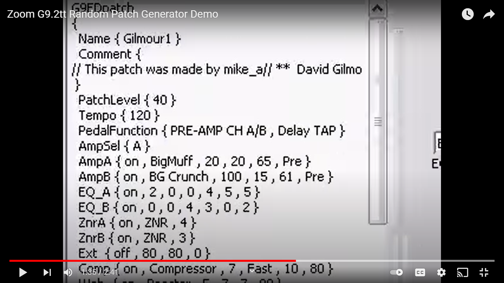
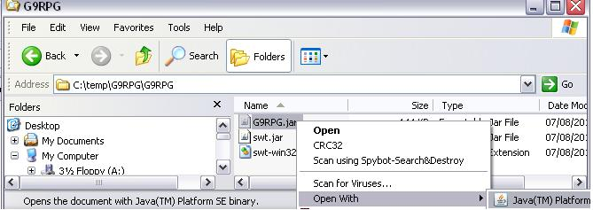
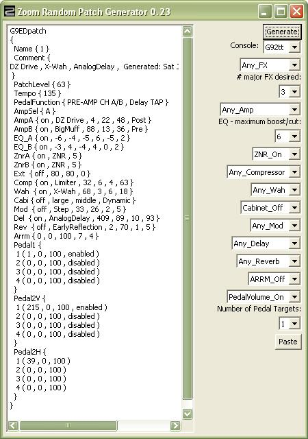
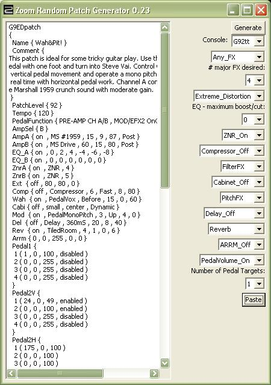
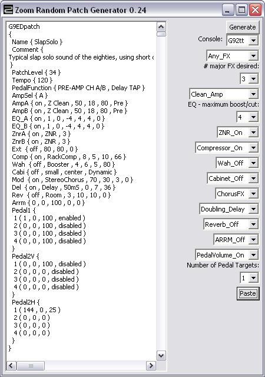

# Random Patch Generator For Zoom G9.2tt / G7.1ut effects pedal

G9RPG demo video: 
 

**Table of Contents**
1. Pre-requisites
2. Downloading and Installing
3. Running
4. Generating a Variation
5. Converting a Patch
6. Known Problems
7. Change History
8. Running the G9.2tt Editor Librarian (G9ED)

*Note: GitHub has a full table of contents with links in the header icon (top left of the readme.md).*

## Pre-requisites
I'm assuming you already have a Zoom G9.2tt or G7.1ut, a computer with a MIDI interface and have installed the Zoom G9ED or G7ED software.

Check you have Java (32-bit) installed:

Windows: **start > Run... > cmd**
then type: 

    java -version
    REM expect 32 bit java (no "64-Bit" in version) (or later) : 
    java version "1.8.0_341"
    Java(TM) SE Runtime Environment (build 1.8.0_341-b10)
    Java HotSpot(TM) Client VM (build 25.341-b10, mixed mode)

If 32 bit Java is not installed then download and install Java from http://java.com/en/download/manual.jsp 

e.g. 2022/08/06 on Microsoft Windows 10 Home on an x64-based PC download 32-bit Java (required for G9RPG). Click on:

    "Windows Offline filesize: 72.73 MB"

Save jre-8u341-windows-i586.exe and Open. Install. Close.

    java -version

    REM expect 32-bit version (or later) : 
    java version "1.8.0_341"
    Java(TM) SE Runtime Environment (build 1.8.0_341-b10)
    Java HotSpot(TM) Client VM (build 25.341-b10, mixed mode)

    java -d64 -version
    REM expect Error as only need 32-bit Java to run G9RPG.
    Error: This Java instance does not support a 64-bit JVM.
    Please install the desired version.

Mac: OS X includes the full version of Java 2SE 1.5. (or later)  **Go > Utilities > Terminal**, then type:

    java -version
    # expect 32 bit java (no "64-Bit" in version)
## Downloading and Installing
Terms and Conditions: ALL INFORMATION AND CONTENT IS PROVIDED ON AN "AS IS" BASIS. IN NO EVENT WILL I BE LIABLE TO ANY PARTY FOR ANY DIRECT, INDIRECT, SPECIAL OR OTHER CONSEQUENTIAL DAMAGES.

### Windows: 
download from GitHub Release and unzip G9RPG.zip

If windows automatically extracts to a Temporary Internet Files folder, then select the G9RPG folder Copy This Folder to "My Documents"

### Mac: 
download from GitHub Release and unzip G9RPG_macosx.zip

When Downloads prompts "G9RPG_macosx" contains an application...", click "Continue". This should unzip G9RPG_macosx.zip on your Desktop.

## Running
### Windows:

Explore to the folder where you unzipped G9RPG e.g. Start>My Documents, then double click on G9RPG

Double click on G9RPG.jar (or right click, Open With .... Java).

If this does not work then try running from command line. e.g. **Start > Run... > cmd** 
 

    REM change to the directory where you unzipped G9RPG
    c:
    cd C:\temp\G9RPG\G9RPG
    REM check directory contains .jar and .dll files
    dir
    REM run from the command line and check any error given
    java -jar G9RPG.jar

### Mac:

Go > Utilities > Terminal, then type:

    cd Desktop/G9RPG_macosx
    . ./g9rpg.sh

Note: important to type as above "dot space dot" to execute the script in the current directory. Then click "Generate" button as above.

### Initial use
Expect the "Zoom Random Patch Generator" window to display:

* If you are using a G7.1ut then select it on the "Effects Processor:" drop down menu.

* Click "Generate", see example screenshot above.

* Start G9ED (or G7ED for G7.1ut users), e.g. see Running the G9.2tt Editor Librarian (G9ED) )

* On your G*ED, select Edit>Paste from Clipboard

* Play that guitar! Audition the patch. Move the pedals through their range. Try the switches (If a Pedal switch is enabled, then pressing the switch under the pedal will turn it on and off. However on some models of the G9.2tt, the switch is too low, so you may have to put some gaffer tape over it for it to work. I use between 4 and 8 squares of duck tape layered over the switch under pedal 1 and pedal 2).

If you like the patch:

* Use G*ED to tweak the patch to your liking and add the finishing touches e.g.

* In G*ED - Patches window, next to "LIB" button, double click on the Random Patch Name e.g. "1" and type a meaningful patch Name, edit the Comment Window.

* Click "SAVE", then click "OK"

* In G*ED:Librarian window, click on next patch for Pasting over.

If you don't like the patch and want to change the generation settings:

* Click "Generate", and repeat, experiment with options on drop down menus

* If the "Effects Processor" is "G92tt" then there is the option to limit the effects choice from: "G7_FX_only", "G9_extra_FX",or "Any_FX"

* Number of major FX (effects) desired: 1 (simple) to 5 (complex) (default=3 major effects)

* Amp: Acoustic, Clean_Amp, Mild_Distortion, Heavy_Distortion, Extreme_Distortion, Any_Amp

* EQ - maximum/boot/cut (dB): from 0 (flat / no EQ) to 12 dB (default = +/- 6dB EQ range)

* ZNR: ZNR_Off, ZNR_On ( on, ZNR, 5 default ) , Any_ZNR

* Comp: Compressor_Off, Compressor_On, Any_Compressor

* Wah: Wah_Off, FilterFX, VolumeFX, PhaserFX, PitchFX, SpecialFX, Any_Wah

* Cabi: Cabinet_Off, Cabinet_On, Any_Cabinet

* Mod: Mod_Off, ChorusFX, FlangerFX, PitchFX, DelayFX, FilterFX, Any_Mod

* Del: Delay_Off, Doubling_Delay, Slapback_Delay, Short_Echoplex, Long_Echoplex, Any_Delay

* Rev: Reverb_Off, Pan_Reverb, Delay_Reverb, Reverb, Any_Reverb

* ARRM (Auto Repeat Real-time Modulation - a Low Frequency Oscillator) ARRM_off (default), ARRM_On

* Use Pedal1 to control the Volume or something else: PedalVolume_On (default), Pedal_Volume_Off

* Number of Pedal Targets (# effects controlled by each pedal movement): 1 (default) to 4

## Generating a Variation
If you want to generate a variation on an existing patch :

* In G*ED:Librarian window, click on the existing “favourite” patch

* On your G*ED, select Edit>Copy to Clipboard

* On the Zoom Random Patch Generator, click Paste (the generation settings are determined from the pasted patch).

* Click "Generate" to produce a variation on the “favourite patch”.

* Audition the patch as above.

As an example here are some generation settings determined from pasting a G9 preset:

## Converting a Patch
To ensure patches are valid and correctly formatted, it is best to start with a patch in the editor provided by Zoom. A patch found on the internet may be incomplete (e.g. missing braces) or wrong (e.g. invalid pedal parameters), so paste and save it in a Zoom editor before using the "Random Patch Generator" to convert. Zoom editors can be downloaded at :
https://zoomcorp.com/en/gb/multi-effects/guitar-effects/g92tt/g92tt-support/

If you want to convert a G7.1ut patch to G9.2tt patch:

* In G7ED:Librarian window, click on a patch

* On G7ED, select Edit>Copy to Clipboard

* On the Zoom Random Patch Generator, ensure the selected Console is "G92tt", and click Paste (the G7EDpatch will be displayed as a G9EDpatch and placed on the clipboard).

* In G9ED:Librarian window, click on a patch for Pasting over.

* On G9ED, select Edit>Paste from Clipboard

* On G9ED, click "SAVE", then click "OK"

* Note: Any G7.1ut pedal targets are put on G9.2tt Pedal 2 Vertical axis, and Pedal 1 is used for volume.

If you want to convert a G9.2tt patch to G7.1ut patch:

* In G9ED:Librarian window, click on a patch

* On G9ED, select Edit>Copy to Clipboard

* On the Zoom Random Patch Generator, ensure the selected Console is "G71ut", and click Paste (the G9EDpatch will be displayed as a G7EDpatch and placed on the clipboard).

* In G7ED:Librarian window, click on a patch for Pasting over.

* On G7ED, select Edit>Paste from Clipboard

* On G7ED, click "SAVE", then click "OK"

* Note: there are limitations in converting G9 patches to G7 patches: fewer amps/effects/pedal targets, so substitutions are made.

If you want to convert a B9.1ut patch to G9.2tt patch:

* In B9ED:Librarian window, click on a patch

* On B9ED, select Edit>Copy to Clipboard

* On the Zoom Random Patch Generator, click Paste (the B9EDpatch will be displayed as a G9EDpatch and placed on the clipboard).

* In G9ED:Librarian window, click on a patch for Pasting over.

* On G9ED, select Edit>Paste from Clipboard

* On G9ED, click "SAVE", then click "OK"

* Note: there are limitations in converting B9 patches to G9 patches: Amp models differ (the B9 uses Bass amp models and has "Synth" amps), B9 EQ goes an octave lower, Cabinet models differ. G9 does not have SOS (Sound on Sound).

As an example here is a G9 patch produced by pasting a B9 preset:

**_Note: the generated patch does not include manual tube settings for Accelerator & Energizer which are not programmable_** 

e.g. on G9:

    "clean"             Accelerator: Tube:  0, Solid State: 8,  Energizer: Tube:  0 Boost:  0
    "clean-tube mix"    Accelerator: Tube:  7, Solid State: 7,  Energizer: Tube:  5 Boost:  5
    "totally filthy"    Accelerator: Tube: 10, Solid State: 0,  Energizer: Tube: 10 Boost: 10

When finished:

* To save a set of patches, in G*ED:Librarian window, File > Export e.g. C:\My Documents\G9RPG\G9Patches.xex
* For some examples of patches generated by G9RPG see: Zoom G9.2tt Patches

To load another set of patches, in G*ED:Librarian window, File > Import

## Known Problems
* Tempo sync note symbol parameters (BPM TAP) are not generated.

* The release is for a 32-bit JVM, but should run on 64 bit hardware e.g. with 

      
    java -version

    java version "1.8.0_311"
    Java(TM) SE Runtime Environment (build 1.8.0_311-b11)
    Java HotSpot(TM) Client VM (build 25.311-b11, mixed mode)

* The program is written as a stand-alone application and is not suitable for inclusion on a web page.

* It is not possible to specify a desired patch by genre or mood, instead the user chooses the physical characteristics of the sound effect.

## Change History

Version

Date

Changes

0.25

2008/09/14

Add function to convert G9.2tt patch to G7.1ut patch (and vice versa) patch using Paste button. Note: there are limitations in converting G9 patches to G7 patches: fewer amps/effects/pedal targets, so substitutions are made.

0.24

2008/08/25

Add function to convert B9.1ut patch to G9.2tt patch using Paste button. Note: there are limitations in converting B9 patches to G9 patches: Amp models differ (the B9 uses Bass amp models and has "Synth" amps), B9 EQ goes an octave lower, Cabinet models differ. G9 does not have SOS (Sound on Sound) etc.

0.23

2008/06/21

Add Paste button which automatically determines settings from the patch on clipboard ( to get variations on a particular patch).

0.22

2008/05/04

Implement options to select settings for Compressor, Cabinet, & Reverb.

0.21

2008/04/26

Implement options to select settings for Wah and Mod. When creating particular patches (e.g. for bass guitar) it is useful to be able to select a class of effect e.g. Chorus.

0.20

2008/04/19

Implement options to select settings for ARRM, ZNR, Pedal Volume, number of Pedal Targets, EQ

0.19

2008/04/12

Implemented effects lists for G7 (not just G9 as before). Old workaround, when using G7, if you see an X-* or Y-* effect generated, click "Generate" again.

Also if the "Effects Processor" is "G92tt" then there is now the option to limit the effects choice from: "G7_FX_only", "G9_extra_FX",or "Any_FX".

Added icon.

0.18

2008/04/05

Fixed Mac: Patch text does not automatically scroll down as generated.(now generated at beginning of text rather than end) Old workaround: after click "Generate", use keyboard Cmd+Down Arrow to see new patch (best to resize window to see all patch).

Changed option to select the precise number of major effects instead of greater than a minimum number.

Limit dissonance on Modulation Z-Pitch, Z-Monopitch, Pitchshifter, Harmonized Pitchshifter, RingMod.

0.17

2008/03/27

## Running the G9.2tt Editor Librarian (G9ED)
Connect the G9.2tt:

* Plug in AC adapter to AC IN on left and mains

* Plug in mono jack to guitar and INPUT on right

* Plug headphones jack into PHONES OUTPUT.

* Plug MIDI interface “IN” cable to “OUT” socket and vice versa

* Turn on G9.2tt POWER switch (position guitar away from monitor to avoid hum or turn down guitar volume

* To tune guitar, on G9.2tt step on BANK ^ and hold for one second until "Bypass" displayed., tune until pitch is correct e.g. display shows ">E<". When finished press one of the BANK footswitches.

Start up the G9ED software:

* Click the [Start] button and select [All Programs] → [ZOOM] → [G9ED] → [G9.2tt Editor Librarian].

* Select MIDI >"MIDI IN" e.g. SB Audigy MIDI IO

* Select MIDI > "MIDI OUT" e.g. SB Audigy MIDI IO

* Switch G9ED to the online state by clicking the "On Line" button so that it appears lit. Tip: after powering off G9.2tt it is necessary to toggle "On Line" again to resume MIDI connection.

